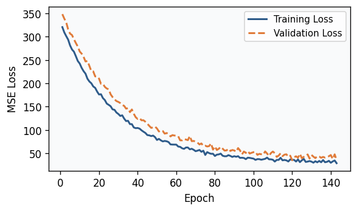
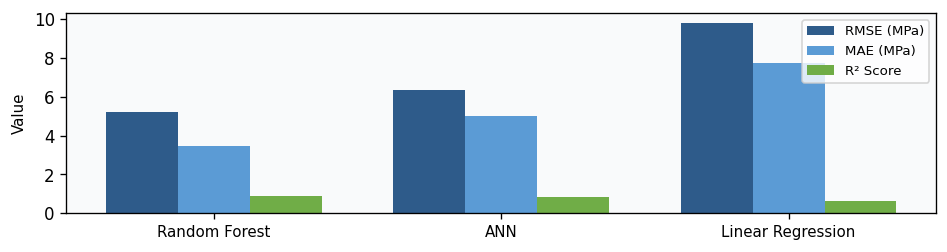
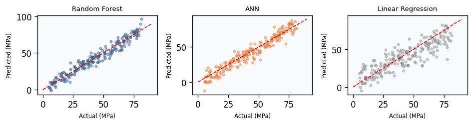
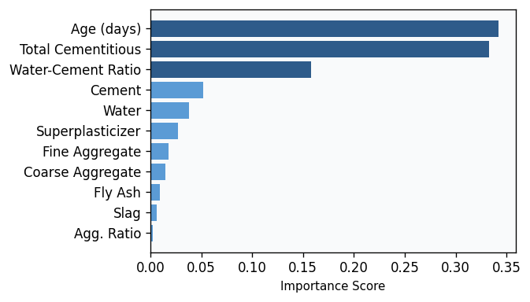

# Prediction of Concrete Compressive Strength using Artificial Neural Networks

> A Comparative Study of Artificial Neural Networks, Random Forest Regression, and Linear Regression

**Course:** ANN & Deep Learning
**Prepared by:** Shaheer Ahmad
**Date:** June 2026

---

## Abstract

Concrete compressive strength is the most critical property used to evaluate the suitability of a concrete mix for construction, yet it is conventionally determined only through physical destructive testing after a 28-day curing period — a process that is both time-consuming and costly. This project develops and compares three regression models — an Artificial Neural Network (ANN), a Random Forest Regressor, and a Linear Regression baseline — to predict concrete compressive strength directly from its mix composition and curing age, using the benchmark UCI Concrete Compressive Strength dataset (1,030 samples).

Three domain-informed features — water-cement ratio, total cementitious material, and aggregate ratio — were engineered prior to modeling. The Random Forest Regressor achieved the strongest performance (RMSE = 5.23 MPa, R² = 0.894), narrowly outperforming the ANN (RMSE = 6.37 MPa, R² = 0.843), while both substantially outperformed the Linear Regression baseline (R² = 0.627) — confirming the strongly non-linear nature of concrete strength formation. The best-performing model was deployed through an interactive Streamlit web application.

---

## Table of Contents

- [Prediction of Concrete Compressive Strength using Artificial Neural Networks](#prediction-of-concrete-compressive-strength-using-artificial-neural-networks)
  - [Abstract](#abstract)
  - [Table of Contents](#table-of-contents)
  - [1. Introduction](#1-introduction)
    - [Problem Statement](#problem-statement)
  - [2. Literature Review](#2-literature-review)
  - [3. Methodology](#3-methodology)
    - [3.1 Dataset Description](#31-dataset-description)
    - [3.2 Data Preprocessing](#32-data-preprocessing)
    - [3.3 Feature Engineering](#33-feature-engineering)
    - [3.4 Model Architectures](#34-model-architectures)
      - [Artificial Neural Network (ANN)](#artificial-neural-network-ann)
      - [Random Forest Regressor](#random-forest-regressor)
      - [Linear Regression](#linear-regression)
  - [4. Results and Discussion](#4-results-and-discussion)
    - [Key Findings](#key-findings)
  - [5. Conclusion](#5-conclusion)
    - [Limitations](#limitations)
    - [Future Work](#future-work)
  - [References](#references)

---

## 1. Introduction

Concrete is the most widely used construction material in the world, and its compressive strength is the primary criterion used by civil engineers to judge whether a given mix design is fit for a structural purpose. Traditionally, this strength is measured by casting concrete cubes or cylinders and physically crushing them after a curing period of 28 days. While reliable, this approach has three practical drawbacks:

- **Slow** — results are only available a full month after mixing
- **Expensive** — requires laboratory equipment, raw material, and skilled supervision
- **Inflexible** — by the time a result is known, the concrete batch is already cast

Compounding this challenge, the relationship between a concrete mix's ingredients and its resulting strength is highly non-linear. This makes the problem a natural candidate for machine learning and deep learning approaches.

### Problem Statement

Given the quantities of raw ingredients used in a concrete mix (cement, blast furnace slag, fly ash, water, superplasticizer, coarse aggregate, fine aggregate) and the curing age in days, can an Artificial Neural Network accurately predict the resulting compressive strength (in MPa) without physical destructive testing — and how does this Deep Learning approach compare against traditional Machine Learning regressors on the same data?

---

## 2. Literature Review

The use of computational intelligence to model concrete properties dates back to the foundational work of Yeh [1], who first demonstrated that an ANN could model the highly non-linear relationship between high-performance concrete ingredients and compressive strength more accurately than traditional regression formulas. This study is also the origin of the benchmark dataset used in the present project.

Building on this foundation, Chou and Pham [2] explored ensemble AI approaches, combining multiple base learners to improve prediction accuracy. Khan et al. [3] later optimized an ANN architecture using a substantially larger dataset of 1,637 samples, identifying cement content and superplasticizer dosage as the most influential predictors. Li et al. [4] conducted a comparative study contrasting ANN predictions against ANFIS and RSM. More recently, Ni et al. [5] surveyed the broader landscape of ML-based concrete property prediction.

**This project addresses two gaps in existing work:**
1. A controlled head-to-head comparison of ANN vs. a non-linear ensemble baseline vs. a linear baseline under identical preprocessing
2. Deployment of the best-performing model as an accessible Streamlit web application for practical use

---

## 3. Methodology

### 3.1 Dataset Description

This project uses the [Concrete Compressive Strength dataset](https://doi.org/10.24432/C5PK67) donated by Prof. I-Cheng Yeh to the UCI Machine Learning Repository [6]. The dataset contains **1,030 instances** with 8 quantitative input features and one continuous target variable.

**Table 1. Descriptive Statistics of Dataset Variables**

| Variable | Mean | Std. Dev. | Min | Max |
|---|---|---|---|---|
| Cement (kg/m³) | 281.17 | 104.51 | 102.00 | 540.00 |
| Blast Furnace Slag (kg/m³) | 73.90 | 86.28 | 0.00 | 359.40 |
| Fly Ash (kg/m³) | 54.19 | 64.00 | 0.00 | 200.10 |
| Water (kg/m³) | 181.57 | 21.35 | 121.80 | 247.00 |
| Superplasticizer (kg/m³) | 6.20 | 5.97 | 0.00 | 32.20 |
| Coarse Aggregate (kg/m³) | 972.92 | 77.75 | 801.00 | 1145.00 |
| Fine Aggregate (kg/m³) | 773.58 | 80.18 | 594.00 | 992.60 |
| Age (days) | 45.66 | 63.17 | 1.00 | 365.00 |
| **Compressive Strength (MPa)** | **35.82** | **16.71** | **2.33** | **82.60** |

---

### 3.2 Data Preprocessing

- **Missing values:** None found across all 9 columns
- **Duplicates:** 25 exact duplicate rows identified and **retained** as valid repeated experimental trials (consistent with original data collection [1])
- **Train-test split:** 80% training (824 samples) / 20% testing (206 samples), fixed random seed for reproducibility
- **Standardization:** Z-score normalization (StandardScaler) fitted **only on training set**, then applied to both — preventing any data leakage from test set into training

---

### 3.3 Feature Engineering

Three additional domain-informed features were engineered beyond the 8 raw ingredient quantities:

| Engineered Feature | Formula | Motivation | Correlation (r) |
|---|---|---|---|
| Water-Cement Ratio (W/C) | Water / Cement | Abrams' Law (1918) — lower W/C = higher strength | −0.501 |
| Total Cementitious Material | Cement + Slag + Fly Ash | All three act as binding agents | +0.613 |
| Aggregate Ratio | Coarse Agg. / Fine Agg. | Influences packing density & workability | +0.049 |

These engineered features brought the total input count from **8 to 11**.

---

### 3.4 Model Architectures

Three regression models were implemented and compared under identical preprocessing:

#### Artificial Neural Network (ANN)

```
Input (11 features)
    → Dense(64, ReLU) → Dropout(0.2)
    → Dense(32, ReLU) → Dropout(0.2)
    → Dense(16, ReLU)
    → Output(1, Linear)
```

- **Optimizer:** Adam (lr = 0.001)
- **Loss:** Mean Squared Error
- **Regularization:** Dropout (rate = 0.2) + EarlyStopping (patience = 20, restore best weights)
- **Training:** Converged at epoch 143 / 300

#### Random Forest Regressor
- 200 decision trees (scikit-learn)
- Used as a strong non-linear traditional ML baseline

#### Linear Regression
- Ordinary Least Squares
- Used to quantify benefit of non-linear models over a simple additive assumption

---

**Figure 1 — ANN Training & Validation Loss Curve**



*Both training and validation loss converged smoothly without divergence — confirming that Dropout and EarlyStopping were effective in preventing overfitting.*

---

## 4. Results and Discussion

All three models were evaluated on the held-out 206-sample test set.

**Table 2. Performance Comparison on Test Set**

| Model | RMSE (MPa) | MAE (MPa) | R² Score |
|---|---|---|---|
| **Random Forest Regressor** | **5.232** | **3.475** | **0.894** |
| Artificial Neural Network | 6.366 | 5.026 | 0.843 |
| Linear Regression | 9.801 | 7.712 | 0.627 |

---

**Figure 2 — Model Comparison: RMSE, MAE, and R² Score**



---

**Figure 3 — Actual vs. Predicted Compressive Strength**



*Red dashed line indicates perfect prediction. Linear Regression shows clear systematic deviation at lower and higher strength values, confirming the non-linear nature of this problem.*

---

### Key Findings

**Random Forest vs. ANN:** The Random Forest slightly outperformed the ANN — consistent with a well-documented characteristic of tree-based ensemble methods on small-to-medium tabular datasets (824 training samples here). Deep learning models typically require substantially larger data volumes to realize their full representational advantage.

**Both non-linear models vs. Linear Regression:** The gap between R² = 0.894/0.843 (RF/ANN) and R² = 0.627 (LR) is large — strong empirical confirmation that the relationship between mix ingredients, curing age, and compressive strength is genuinely non-linear.

---

**Figure 4 — Feature Importance (Random Forest)**



| Rank | Feature | Importance |
|---|---|---|
| 1 | Age (days) | 34.2% |
| 2 | Total Cementitious Material | 33.3% |
| 3 | Water-Cement Ratio | 15.8% |
| 4–11 | Raw ingredient quantities | 16.7% (combined) |

Both engineered features (Total Cementitious Material and Water-Cement Ratio) rank in the **top 3**, ahead of several raw ingredient quantities — strongly validating the feature engineering decisions.

The best-performing model was deployed as an interactive **Streamlit web application** allowing engineers to enter raw mix quantities and receive instant predicted compressive strength — with side-by-side comparison across all three models.

---

## 5. Conclusion

This project developed and rigorously compared three regression models for predicting concrete compressive strength from mix composition and curing age. Key takeaways:

- **Random Forest** achieved best performance (R² = 0.894), ANN close behind (R² = 0.843), both decisively outperforming the Linear Regression baseline (R² = 0.627)
- The problem is **strongly non-linear** — confirmed both by model results and by the feature importance of domain-engineered ratios
- **Engineered features** (W/C ratio, total cementitious material) carry more predictive signal than several individual raw ingredients
- Best model deployed in a **Streamlit web app** as a practical alternative to 28-day destructive testing

### Limitations

- Only 1,030 samples (824 training) — relatively small for deep learning, likely limiting the ANN's advantage
- 25 duplicate records may slightly affect train/test independence interpretation
- Predictions outside the training distribution ranges (e.g. ultra-high-performance concretes) should be treated with caution

### Future Work

- Collect additional samples, especially at extreme ingredient ranges
- Systematic hyperparameter tuning (Keras Tuner for ANN, Grid Search for RF)
- Explore stacked/blended ensembles combining ANN and Random Forest
- Add SHAP values for ANN interpretability

---

## References

[1] I.-C. Yeh, "Modeling of strength of high-performance concrete using artificial neural networks," *Cement and Concrete Research*, vol. 28, no. 12, pp. 1797–1808, 1998.

[2] J.-S. Chou and A.-D. Pham, "Enhanced artificial intelligence for ensemble approach to predicting high performance concrete compressive strength," *Construction and Building Materials*, vol. 49, pp. 554–563, 2013.

[3] A. Q. Khan et al., "Optimized artificial neural network model for accurate prediction of compressive strength of normal and high strength concrete," *Cleaner Materials*, vol. 10, p. 100211, 2023.

[4] T. Li et al., "Predicting high-strength concrete's compressive strength: A comparative study of ANN, ANFIS, and RSM," *Materials*, vol. 17, no. 18, p. 4533, 2024.

[5] B. Ni et al., "A review on properties and multi-objective performance predictions of concrete based on machine learning models," *Materials Today Communications*, vol. 44, p. 112017, 2025.

[6] I. Yeh, "Concrete Compressive Strength," UCI Machine Learning Repository, 1998. doi: [10.24432/C5PK67](https://doi.org/10.24432/C5PK67)

[7] F. Pedregosa et al., "Scikit-learn: Machine Learning in Python," *JMLR*, vol. 12, pp. 2825–2830, 2011.

[8] M. Abadi et al., "TensorFlow: A System for Large-Scale Machine Learning," in *Proc. 12th USENIX OSDI*, 2016.

---

<p align="center">
  <sub>ANN & Deep Learning — Course Project | Shoaib | June 2026</sub>
</p>
